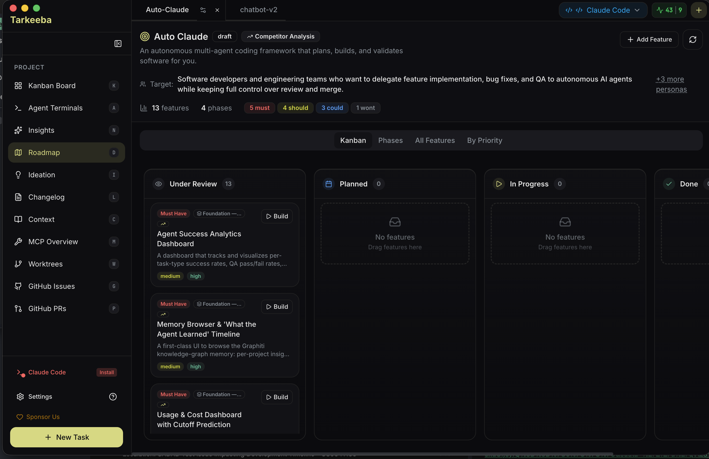

# Tarkeeba

**A provider-neutral desktop workspace that plans, builds, and validates software with autonomous coding agents.**

Tarkeeba currently supports Anthropic Claude Code and OpenAI Codex, including model selection and separate account profiles for each provider.


[](./agpl-3.0.txt)
[](https://github.com/mohamedjanemr/tarkeeba/actions)

---

## Download

### Stable Release

<!-- STABLE_VERSION_BADGE -->
No Tarkeeba stable release has been published yet.
<!-- STABLE_VERSION_BADGE_END -->

<!-- STABLE_DOWNLOADS -->
Downloads will appear here after the first stable release.
<!-- STABLE_DOWNLOADS_END -->

### Beta Release

> ⚠️ Beta releases may contain bugs and breaking changes. [View all releases](https://github.com/mohamedjanemr/tarkeeba/releases)
>
> `2.8.0-beta.1` is an unsigned preview distributed through GitHub Releases. macOS Gatekeeper and Windows SmartScreen may warn before launch; verify the published SHA256 checksums before installing.

<!-- BETA_VERSION_BADGE -->
[](https://github.com/mohamedjanemr/tarkeeba/releases/tag/v2.8.0-beta.1)
<!-- BETA_VERSION_BADGE_END -->

<!-- BETA_DOWNLOADS -->
| Platform | Download |
|----------|----------|
| **Windows** | [Tarkeeba-2.8.0-beta.1-win32-x64.exe](https://github.com/mohamedjanemr/tarkeeba/releases/download/v2.8.0-beta.1/Tarkeeba-2.8.0-beta.1-win32-x64.exe) |
| **macOS (Apple Silicon)** | [Tarkeeba-2.8.0-beta.1-darwin-arm64.dmg](https://github.com/mohamedjanemr/tarkeeba/releases/download/v2.8.0-beta.1/Tarkeeba-2.8.0-beta.1-darwin-arm64.dmg) |
| **macOS (Intel)** | [Tarkeeba-2.8.0-beta.1-darwin-x64.dmg](https://github.com/mohamedjanemr/tarkeeba/releases/download/v2.8.0-beta.1/Tarkeeba-2.8.0-beta.1-darwin-x64.dmg) |
| **Linux** | [Tarkeeba-2.8.0-beta.1-linux-x86_64.AppImage](https://github.com/mohamedjanemr/tarkeeba/releases/download/v2.8.0-beta.1/Tarkeeba-2.8.0-beta.1-linux-x86_64.AppImage) |
| **Linux (Debian)** | [Tarkeeba-2.8.0-beta.1-linux-amd64.deb](https://github.com/mohamedjanemr/tarkeeba/releases/download/v2.8.0-beta.1/Tarkeeba-2.8.0-beta.1-linux-amd64.deb) |
| **Linux (Flatpak)** | [Tarkeeba-2.8.0-beta.1-linux-x86_64.flatpak](https://github.com/mohamedjanemr/tarkeeba/releases/download/v2.8.0-beta.1/Tarkeeba-2.8.0-beta.1-linux-x86_64.flatpak) |
<!-- BETA_DOWNLOADS_END -->

> All releases include SHA256 checksums and VirusTotal scan results for security verification.

---

## Requirements

- **At least one AI provider** - Claude Code or OpenAI Codex
- **Claude option** - Claude Pro/Max plus `npm install -g @anthropic-ai/claude-code`
- **Codex option** - Codex CLI authenticated with `codex login`
- **Git repository** - Your project must be initialized as a git repo

---

## Quick Start

1. **Download and install** the app for your platform
2. **Open your project** - Select a git repository folder
3. **Connect a provider** - Onboard a Claude Code or OpenAI account in Settings
4. **Create a task** - Describe what you want to build
5. **Watch it work** - Agents plan, code, and validate autonomously

---

## Features

| Feature | Description |
|---------|-------------|
| **Autonomous Tasks** | Describe your goal; agents handle planning, implementation, and validation |
| **Provider Choice** | Select Claude Code or OpenAI Codex, account, and model per session |
| **Parallel Execution** | Run multiple builds simultaneously with up to 12 agent terminals |
| **Isolated Workspaces** | All changes happen in git worktrees - your main branch stays safe |
| **Self-Validating QA** | Built-in quality assurance loop catches issues before you review |
| **AI-Powered Merge** | Automatic conflict resolution when integrating back to main |
| **Memory Layer** | Agents retain insights across sessions for smarter builds |
| **GitHub/GitLab Integration** | Import issues, investigate with AI, create merge requests |
| **Linear Integration** | Sync tasks with Linear for team progress tracking |
| **Cross-Platform** | Native desktop apps for Windows, macOS, and Linux |
| **Auto-Updates** | App updates automatically when new versions are released |

---

## Interface

### Kanban Board
Visual task management from planning through completion. Create tasks and monitor agent progress in real-time.

### Agent Terminals
AI-powered terminals with one-click task context injection. Spawn multiple agents for parallel work.


### Roadmap
AI-assisted feature planning with competitor analysis and audience targeting.



### Additional Features
- **Insights** - Chat interface for exploring your codebase
- **Ideation** - Discover improvements, performance issues, and vulnerabilities
- **Changelog** - Generate release notes from completed tasks

---

## Project Structure

```
Auto-Claude/
├── apps/
│   ├── backend/     # Python agents, specs, QA pipeline
│   └── frontend/    # Electron desktop application
├── guides/          # Additional documentation
├── tests/           # Test suite
└── scripts/         # Build utilities
```

---

## CLI Usage

For headless operation, CI/CD integration, or terminal-only workflows:

```bash
cd apps/backend

# Create a spec interactively
python spec_runner.py --interactive

# Run autonomous build
python run.py --spec 001

# Review and merge
python run.py --spec 001 --review
python run.py --spec 001 --merge
```

See [guides/CLI-USAGE.md](guides/CLI-USAGE.md) for complete CLI documentation.

---

## Development

Want to build from source or contribute? See [CONTRIBUTING.md](CONTRIBUTING.md) for complete development setup instructions.

For Linux-specific builds (Flatpak, AppImage), see [guides/linux.md](guides/linux.md).

---

## Security

Tarkeeba uses a three-layer security model:

1. **OS Sandbox** - Bash commands run in isolation
2. **Filesystem Restrictions** - Operations limited to project directory
3. **Dynamic Command Allowlist** - Only approved commands based on detected project stack

All releases are:
- Scanned with VirusTotal before publishing
- Include SHA256 checksums for verification
- Code-signed where applicable (macOS)

---

## Available Scripts

| Command | Description |
|---------|-------------|
| `npm run install:all` | Install backend and frontend dependencies |
| `npm start` | Build and run the desktop app |
| `npm run dev` | Run in development mode with hot reload |
| `npm run package` | Package for current platform |
| `npm run package:mac` | Package for macOS |
| `npm run package:win` | Package for Windows |
| `npm run package:linux` | Package for Linux |
| `npm run package:flatpak` | Package as Flatpak (see [guides/linux.md](guides/linux.md)) |
| `npm run lint` | Run linter |
| `npm test` | Run frontend tests |
| `npm run test:backend` | Run backend tests |

---

## Contributing

We welcome contributions! Please read [CONTRIBUTING.md](CONTRIBUTING.md) for:
- Development setup instructions
- Code style guidelines
- Testing requirements
- Pull request process

---

## Community

- **Issues** - [Report bugs or request features](https://github.com/mohamedjanemr/tarkeeba/issues)
- **Discussions** - [Ask questions](https://github.com/mohamedjanemr/tarkeeba/discussions)

---

## License

**AGPL-3.0** - GNU Affero General Public License v3.0

Tarkeeba is free software. If you modify and distribute it, or offer a modified version over a network, review and comply with the AGPL-3.0 source-availability requirements.

---

## Origin and attribution

Tarkeeba is an independent AGPL-3.0 fork of [Auto-Claude](https://github.com/B1tMaster/Auto-Claude), whose upstream project is now [Aperant](https://github.com/AndyMik90/Aperant). It is not affiliated with Anthropic or OpenAI. Original copyright and contributor history remain available in this repository's Git history and changelog.
